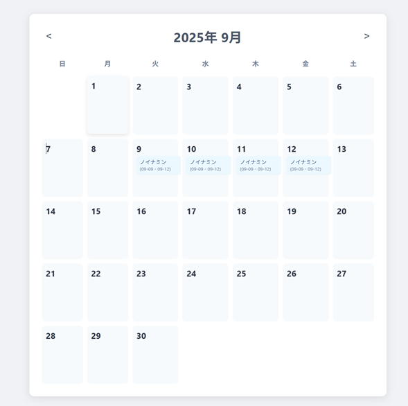

# カレンダー予定管理アプリ

Flask と SQLite を使ったシンプルな予定管理アプリです。  
月カレンダー上に予定を登録・編集・削除・完了管理ができます。  
Render にデプロイして動作確認済みです（Free プランではサーバー再起動でデータは消去されます）。

## 主な機能
- 月カレンダー表示
- 予定の新規登録（タイトル・開始/終了日・時間）
- 予定の編集（内容・日付・時間）
- 予定の削除
- 予定の完了チェック（取り消し線で表示）
- 複数日にまたがる予定の表示対応

## プレビュー画像


## 技術スタック
- Python 3.x
- Flask
- Flask-SQLAlchemy
- SQLite
- HTML / CSS / JavaScript
- デプロイ先: [Render](https://render.com)

## ディレクトリ構成
```
Medication_UP-main/
├── app.py              # Flask アプリ本体
├── requirements.txt    # 依存パッケージ
├── templates/
│   └── index.html      # カレンダー画面
├── static/
│   ├── script.js       # フロント側処理
│   └── style.css       # デザイン
└── schedules.db        # SQLite DB（自動生成）
```
## セットアップ手順

### ローカル実行
1. このリポジトリをクローン
```
git clone https://github.com/yourname/Medication_UP-main.git
cd Medication_UP-main
```
2. 仮想環境を作成して有効化
```
python -m venv venv
# Windows
venv\Scripts\activate
# macOS/Linux
source venv/bin/activate
```
3. 依存関係をインストール
```
pip install -r requirements.txt
```
4. アプリを起動
```
python app.py
```
5. ブラウザで http://localhost:5000 にアクセス

### Render デプロイ
* Build Command
```
pip install -r requirements.txt
```
* Start Command
```
gunicorn app:app --bind 0.0.0.0:$PORT --workers 1 --threads 8 --timeout 120
```
* Free プランでは DB は揮発性（再起動で消去）。永続化する場合は Starter 以上で Persistent Disk または PostgreSQL を利用。

## 注意点
* Free プランの Render ではサーバー再起動でデータは初期化されます。
* 永続化が必要な場合は Persistent Disk（Starter 以上）か PostgreSQL を利用してください。

## ライセンス
MIT License